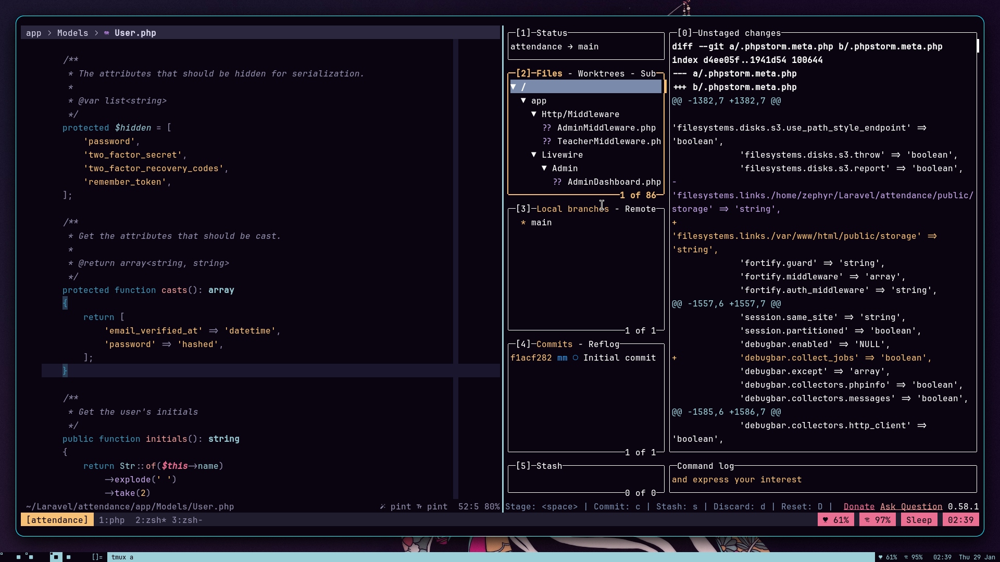
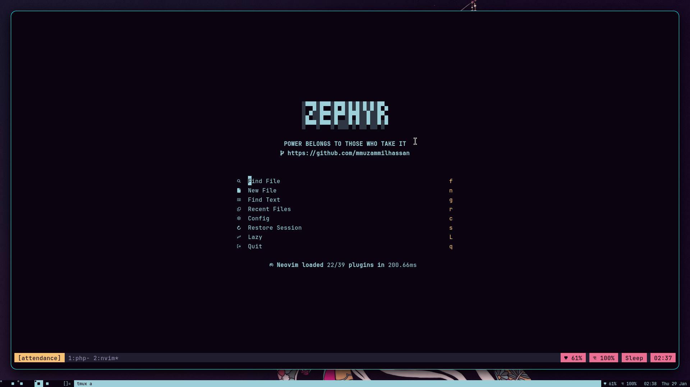

# .dotfiles

> **"The factory of the future will have only two employees, a man and a dog. The man will be there to feed the dog. The dog will be there to keep the man from touching the equipment."** > — *Warren Bennis (but mostly, I just like automating things).*



## Overview
Welcome to my personal configuration files (dotfiles). This repository hosts my entire **Arch Linux** development environment, tailored specifically for **PHP & Laravel** development. 

The goal is simple: **Maximum screen real estate, zero mouse usage, and sub-second workflow speeds.**

## The Stack
This setup is built around the "Suckless" philosophy—software that sucks less.

| Component | Choice | Description |
|-----------|--------|-------------|
| **OS** | Arch Linux | I use Arch, btw. |
| **WM** | [dwm](./.local/src/dwm) | Patched dynamic window manager (Fibonacci, Scratchpads). |
| **Terminal** | [st](./.local/src/st) | The simple terminal. Patched for Scrollback, Alpha, and Boxdraw. |
| **Editor** | Neovim | Custom Lua config for full Stack PHP Laravel support (LSP, Treesitter). |
| **Bar** | [dwmblocks](./.local/src/dwmblocks) | Minimalist status bar with custom scripts. |
| **Shell** | Zsh | Optimized with custom aliases for `artisan` and `composer`. |

## Visuals
### The Clean Desktop


### The "Laravel" Workflow (Neovim + TMUX)
*Custom Neovim setup with Intelephense, Blade formatting, and database integration.*


## Structure
Unlike standard dotfiles, I keep my source-built tools directly in this repo for portability.
* **`.config/nvim`** - My IDE. 100% Lua based.
* **`.local/src`** - Source code for `dwm`, `st`, `slock`, and `dwmblocks`.
* **`.local/bin`** - Custom shell scripts for server management and automation.

## Installation
(If you are brave enough to run my setup)

1. **Clone the repo:**
   ```bash
   git clone [https://github.com/mmuzammilhassan/.dotfiles.git](https://github.com/mmuzammilhassan/.dotfiles.git) ~/.dotfiles
   cd ~/.dotfiles

I manage my dotfiles using [GNU Stow](https://www.gnu.org/software/stow/).

**Dotfiles v2.4**
